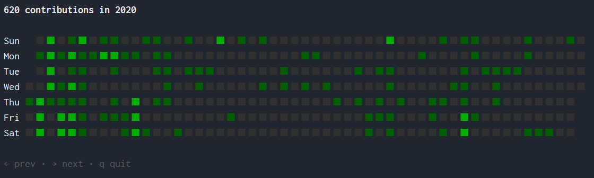

# git-contributions-visualizer

A terminal-based tool that aggregates Git contributions across multiple repositories and displays them as GitHub-style heatmaps.



## Features

- Scans a directory for all Git repositories and aggregates commit history
- Displays a GitHub-style contribution heatmap in the terminal with color-coded intensity
- Supports multiple email addresses to track contributions across accounts
- Navigate between years to view historical contribution data
- Defaults to your global Git config email if none is specified

## Usage

```
git-contributions-visualizer [options] [project-dir]
```

### Arguments

| Argument | Description | Default |
|---|---|---|
| `project-dir` | Directory containing your Git repositories | `.` (current directory) |

### Options

| Flag | Description |
|---|---|
| `-emails` | Comma-separated list of email addresses to filter contributions by |

### Examples

```bash
# Visualize contributions from all repos in ~/projects using your git config email
git-contributions-visualizer ~/projects

# Visualize contributions for specific email addresses
git-contributions-visualizer -emails "work@example.com,personal@example.com" ~/projects
```

### Navigation

| Key | Action |
|---|---|
| `j` / `h` / `Down` / `Left` | Next year |
| `k` / `l` / `Up` / `Right` | Previous year |
| `q` / `Esc` / `Ctrl+C` | Quit |

## Installation

```bash
go install github.com/is386/git-contributions-visualizer@latest
```

Or build from source:

```bash
git clone https://github.com/is386/git-contributions-visualizer.git
cd git-contributions-visualizer
go build -o git-contributions-visualizer .
```
